## UtterAI AI Module

언어치료 세션 음성을 분석해 SOAP Note 초안을 생성하는 AI 파이프라인 레포입니다.

---

## 진행 상황

### 기반 설정

| 상태 | 항목 |
|------|------|
| ✅ | 레포 구조 생성 및 기본 설정 파일 (`Dockerfile`, `requirements.txt`, `.env.example`) |
| ✅ | 환경 변수 기반 설정 관리 (`app/config.py` — pydantic-settings) |

### `app/schemas/`

| 상태 | 항목 |
|------|------|
| ✅ | `job.py` — 분석 Job 요청/상태/실패 스키마 |
| ✅ | `audio.py` — 오디오 파일 메타데이터 스키마 |
| ✅ | `segment.py` — VAD / 화자 분리 / ASR 구간 스키마 |
| ✅ | `transcript.py` — 형태소, 발화 단위(Utterance) 스키마 |
| ✅ | `metrics.py` — 언어 지표 (MLU, NTW, NDW, TTR, latency) 스키마 |
| ✅ | `rag.py` — RAG 청크, 검색 쿼리, 검색 결과 스키마 |
| ✅ | `report.py` — SOAP Note, ClinicalFlag, ReportDraft 스키마 |

### `app/models/`

| 상태 | 항목 |
|------|------|
| ✅ | `vad_silero.py` — Silero VAD `load` / `predict` 구현 |
| ✅ | `asr_whisper.py` — Whisper STT `load` / `predict` 구현 |
| ✅ | `diarization_pyannote.py` — pyannote 화자 분리 `load` / `predict` 구현 (pyannote ≥ 3.3 DiarizeOutput 호환 포함) |
| ✅ | `embedding_kure.py` — KURE-v1 임베딩 `load` / `predict` 구현 |
| ✅ | `llm_exaone.py` — EXAONE LLM `load` / `predict` 구현 |

### `app/pipelines/`

| 상태 | 항목 |
|------|------|
| ✅ | `audio_preprocess.py` — ffmpeg 기반 오디오 전처리 스켈레톤 |
| ✅ | `alignment.py` — VAD + 화자 분리 + STT 정렬 → Utterance 생성 (Kiwi 형태소 분석 포함) |
| ✅ | `metrics_pipeline.py` — 화자별 MLU / NTW / NDW / TTR / 반응 지연 시간 계산 |
| ✅ | `report_pipeline.py` — EXAONE 호출 + JSON 파싱 retry + schema repair |
| ⬜ | `analysis_pipeline.py` — 전체 파이프라인 오케스트레이터 구현 |

### `app/metrics/`

| 상태 | 항목 |
|------|------|
| ✅ | `mlu.py` — 형태소 기준 MLU 계산 |
| ✅ | `lexical_diversity.py` — NTW / NDW / TTR 계산 |
| ✅ | `response_latency.py` — THERAPIST → CHILD 반응 지연 시간 계산 |

### `app/rag/`

| 상태 | 항목 |
|------|------|
| ✅ | `ontology.yaml` — 도메인 개념 사전 (MLU, TTR, SOAP 등) |
| ✅ | `semantic_layer.py` — Kiwi 키워드 → ontology 기반 쿼리 확장 + 메타데이터 필터 |
| ✅ | `prompt_templates.py` — EXAONE 입력 프롬프트 빌더 |
| ✅ | `chunker.py` — 문장 단위 분할 + sliding window overlap |
| ✅ | `ingest.py` — 문서 파일 → 청크 → 임베딩 → pgvector 저장 |
| ✅ | `vector_store.py` — pgvector ORM + upsert / cosine similarity 검색 |
| ✅ | `rag_graph.py` — LangGraph StateGraph 기반 RAG 쿼리 파이프라인 |
| ✅ | `retriever.py` — rag_graph 래퍼 (외부 호출용) |

### `app/api/`

| 상태 | 항목 |
|------|------|
| ✅ | `health.py` — `/health/live`, `/health/ready` 엔드포인트 스켈레톤 |
| ✅ | `jobs.py` — 분석 Job 생성/조회 엔드포인트 스켈레톤 |
| ✅ | `rag.py` — RAG ingest / query 엔드포인트 스켈레톤 |

### `app/workers/`

| 상태 | 항목 |
|------|------|
| ⬜ | `analysis_worker.py` — SQS 폴링 루프 + 분석 파이프라인 연결 |
| ⬜ | `rag_ingest_worker.py` — SQS 폴링 루프 + RAG 문서 ingest 연결 |

### `app/storage/`

| 상태 | 항목 |
|------|------|
| ✅ | `s3_client.py` — boto3 기반 S3 업로드/다운로드 스켈레톤 |
| ✅ | `db.py` — SQLAlchemy async 엔진 + 세션 설정 |

### `docs/`

| 상태 | 항목 |
|------|------|
| ✅ | `AI_IMPLEMENTATION_GUIDE.md` — AI 모델 구현 상세 설계서 |
| ✅ | `RAG_IMPLEMENTATION.md` — RAG 파이프라인 구현 상세 (indexing, LangGraph query) |
| ✅ | `MODEL_LOADING_GUIDE.md` — 모델별 HF 자동 다운로드 방식 및 VRAM 요구사항 |
| ✅ | `EKS_WORKER_ARCHITECTURE.md` — CPU/GPU Worker 분리 배포 및 KEDA 오토스케일링 |
| ✅ | `AI_PIPELINE_OPTIMIZATION.md` — 모델별 병목 원인 분석 및 단계별 최적화 방법 |

---

## 폴더 구조 및 역할

```
app/
├── config.py          환경 변수 로드 (pydantic-settings, .env 기반)
├── main.py            FastAPI 앱 진입점, 라우터 등록
│
├── schemas/           서비스 전체에서 사용하는 데이터 계약 정의
│                      모델 출력 → 파이프라인 → API → 저장 전 단계의 타입을 통일
│
├── models/            AI 모델 래퍼 (Hugging Face 모델 로드 + 추론)
│                      load() 한 번 호출 후 predict()를 반복 사용하는 구조
│                      VAD / ASR / 화자분리 / 임베딩 / LLM 각각 독립 파일
│
├── pipelines/         여러 모델과 계산 로직을 순서대로 연결하는 오케스트레이터
│                      alignment: VAD + 화자분리 + STT 세 결과를 Utterance로 합침
│                      metrics_pipeline: Utterance → 화자별 언어 지표 산출
│                      report_pipeline: RAG 근거 + 지표 → EXAONE → SOAP Note 초안
│                      analysis_pipeline: 전체 단계를 순서대로 실행하는 진입점
│
├── metrics/           언어 지표 계산 순수 함수 모음 (모델 의존 없음)
│                      mlu.py: 형태소 기준 MLU
│                      lexical_diversity.py: NTW / NDW / TTR
│                      response_latency.py: THERAPIST → CHILD 반응 지연 시간
│
├── rag/               RAG(Retrieval-Augmented Generation) 전체 파이프라인
│                      [Indexing] ingest → chunker → embedding → vector_store(pgvector)
│                      [Query]    retriever → rag_graph(LangGraph) → semantic_layer → vector_store
│                      ontology.yaml: 도메인 개념 사전 (키워드 확장에 사용)
│                      prompt_templates.py: EXAONE 입력 프롬프트 조립
│
├── api/               FastAPI 라우터 (HTTP 엔드포인트)
│                      health: 프로세스 생존 및 모델/DB 준비 상태 확인
│                      jobs: 분석 Job 생성 및 상태 조회
│                      rag: 문서 ingest, 검색, 리포트 초안 생성
│
├── workers/           SQS 폴링 루프 (비동기 Job 처리)
│                      analysis_worker: CPU/GPU 파이프라인 순서 조율
│                      rag_ingest_worker: 문서 업로드 → chunk → pgvector 저장
│
└── storage/           외부 저장소 클라이언트
                       s3_client: 음성 파일 / 결과 JSON / RAG 문서 업로드·다운로드
                       db.py: PostgreSQL(pgvector) async 연결 설정
```

---

## 1. 이 레포의 담당 범위

| 구분 | 담당 | 설명 |
|---|---|---|
| 음성 업로드 화면 | ❌ | `UtterAI_FE` 담당 |
| 사용자/세션 API | ❌ | `UtterAI_BE` 담당 |
| AI 모델 추론 | ✅ | VAD, 화자 분리, STT, 임베딩, LLM |
| 언어 지표 계산 | ✅ | MLU, NDW, NTW, TTR, 반응 지연 시간 |
| RAG 검색 | ✅ | 언어발달/치료 문서 검색, 근거 추출 |
| SOAP Note 초안 생성 | ✅ | 검색 근거 기반 LLM 리포트 초안 생성 |
| 인프라 배포 정의 | ❌ | `UtterAI_Infra` 담당 |

---

## 2. AI 모듈의 처리 흐름

```text
원본 음성
  → 말한 구간 감지 (Silero VAD)
  → 화자 분리 (pyannote)
  → STT 전사 (Whisper)
  → 발화 단위 정렬 (alignment + Kiwi 형태소 분석)
  → 언어 지표 계산 (MLU / NTW / NDW / TTR / 반응 지연 시간)
  → 관련 문서 RAG 검색 (KURE-v1 + pgvector + LangGraph)
  → SOAP Note 초안 생성 (EXAONE)
  → 치료사 검토용 결과 반환
```

최종 결과는 **치료사를 대체하는 자동 진단 결과가 아니라**, 치료사가 검토하고 수정할 수 있는 **임상 업무 보조 초안**입니다.

---

## 3. AI 모델 구성

| 단계 | 모델 | 실행 위치 | 역할 |
|---|---|---|---|
| VAD | `onnx-community/silero-vad` | CPU Worker | 말한 구간과 침묵 구간 분리 |
| 화자 분리 | `pyannote/speaker-diarization-3.1` | GPU Worker | 화자별 발화 구간 분리 |
| STT | `openai/whisper-large-v3-turbo` | GPU Worker | 음성 → 텍스트 전사 |
| 형태소 분석 | `kiwipiepy` | CPU Worker | 한국어 형태소 분석, RAG 키워드 추출 |
| 임베딩 | `nlpai-lab/KURE-v1` | CPU Worker | 문서/쿼리 1024차원 벡터 변환 |
| LLM | `LGAI-EXAONE/EXAONE-3.5-2.4B-Instruct` | GPU Worker | SOAP Note 초안 생성 |
| 언어 지표 | Python 계산 로직 | CPU Worker | MLU / NDW / NTW / TTR 계산 |

모델은 코드에서 `load()` 호출 시 Hugging Face Hub에서 자동 다운로드됩니다.
자세한 내용은 [`docs/MODEL_LOADING_GUIDE.md`](docs/MODEL_LOADING_GUIDE.md)를 참고합니다.

---

## 4. 전체 처리 흐름

```mermaid
flowchart LR
    A[Backend에서 분석 Job 생성] --> B[S3 원본 음성 저장]
    B --> C[SQS 분석 요청 메시지]
    C --> D[AI Worker Job 수신]
    D --> E[VAD 말한 구간 감지]
    E --> F[화자 분리]
    F --> G[Whisper STT]
    G --> H[발화 단위 정렬]
    H --> I[언어 지표 계산]
    I --> J[RAG 문서 검색]
    J --> K[LLM 리포트 초안 생성]
    K --> L[S3 결과 JSON 저장]
    L --> M[RDS 메타데이터 저장]
    M --> N[Backend에서 결과 조회]
```



---

## 5. 저장소 역할 분리

| 저장 위치 | 저장 대상 |
|---|---|
| S3 | 원본 음성, 전처리 음성, transcript JSON, report JSON, RAG 원본 문서 |
| RDS PostgreSQL | 사용자/세션/오디오/화자/발화 메타데이터, 언어 지표, 리포트 상태 |
| RDS + pgvector | RAG chunk 임베딩 (문서 벡터 검색) |

---

## 6. 로컬 실행

```bash
# 환경 설정
python -m venv .venv
.venv\Scripts\activate      # Windows
source .venv/bin/activate   # macOS / Linux

pip install -r requirements.txt
cp .env.example .env        # .env 에 HF_TOKEN 등 입력

# API 실행
uvicorn app.main:app --host 0.0.0.0 --port 8000 --reload

# 헬스 체크
curl http://localhost:8000/health/live
curl http://localhost:8000/health/ready
```

---

## 7. 핵심 API

| Method | Path | 설명 |
|---|---|---|
| `GET` | `/health/live` | 프로세스 생존 확인 |
| `GET` | `/health/ready` | 모델/DB/S3 연결 준비 상태 확인 |
| `POST` | `/ai/jobs` | 분석 Job 생성 요청 |
| `GET` | `/ai/jobs/{job_id}` | 분석 Job 상태 조회 |
| `POST` | `/ai/rag/ingest` | RAG 문서 수집/청크/임베딩 |
| `POST` | `/ai/rag/query` | RAG 검색 테스트 |
| `POST` | `/ai/reports/draft` | RAG 기반 리포트 초안 생성 |

---

## 8. 배포 구조

CPU Worker와 GPU Worker를 EKS에서 분리 배포합니다.

| Worker | 담당 모델 | 인스턴스 |
|---|---|---|
| CPU Worker | VAD, KURE-v1, Kiwi, 지표 계산, RAG 검색 | c5.xlarge |
| ML GPU Worker | pyannote, Whisper | g4dn.xlarge (T4 16 GB) |
| LLM GPU Worker | EXAONE | g5.xlarge (A10G 24 GB) |

GPU Worker는 pyannote + Whisper 담당과 EXAONE 담당으로 분리해 독립 스케일링합니다.
모델 Cold Start 제거, VRAM 관리, 처리 시간 단축 방법은 [`docs/AI_PIPELINE_OPTIMIZATION.md`](docs/AI_PIPELINE_OPTIMIZATION.md)를 참고합니다.
인프라 배포 구성 상세는 [`docs/EKS_WORKER_ARCHITECTURE.md`](docs/EKS_WORKER_ARCHITECTURE.md)를 참고합니다.

---

## 9. 결과물 예시

```json
{
  "job_id": "job_001",
  "session_id": "session_001",
  "status": "COMPLETED",
  "transcript": {
    "utterances": [
      {
        "speaker": "CHILD",
        "start_time": 1.25,
        "end_time": 3.10,
        "text": "엄마 이거 봐",
        "confidence": 0.91
      }
    ]
  },
  "metrics": {
    "mlu": 3.8,
    "ntw": 142,
    "ndw": 76,
    "ttr": 0.535,
    "average_response_latency_sec": 1.42
  },
  "rag_evidence": [
    {
      "document_id": "doc_001",
      "title": "언어발달 평가 가이드",
      "chunk_id": "chunk_014",
      "score": 0.82
    }
  ],
  "report": {
    "soap_note": {
      "subjective": "...",
      "objective": "...",
      "assessment": "...",
      "plan": "..."
    },
    "review_required": true
  }
}
```

---

## 10. 운영 원칙

- 원본 음성, 전사 결과, 리포트는 민감 데이터로 취급합니다.
- 로그에는 원문 음성, 전체 전사문, 개인정보를 남기지 않습니다.
- 모델 출력은 반드시 치료사 검토 대상으로 표시합니다.
- RAG 답변은 검색된 근거 문서 안에서만 생성합니다.
- 모델 버전, 프롬프트 버전, RAG 문서 버전은 결과와 함께 기록합니다.
- 오류 발생 시 Job 상태를 `FAILED`로 저장하고 재시도 가능하게 설계합니다.

---

## 11. 관련 문서

| 문서 | 내용 |
|---|---|
| [`docs/AI_IMPLEMENTATION_GUIDE.md`](docs/AI_IMPLEMENTATION_GUIDE.md) | AI 모델 구현 상세 설계서 |
| [`docs/AI_PIPELINE_OPTIMIZATION.md`](docs/AI_PIPELINE_OPTIMIZATION.md) | 모델별 병목 원인 분석 및 단계별 최적화 방법 |
| [`docs/RAG_IMPLEMENTATION.md`](docs/RAG_IMPLEMENTATION.md) | RAG indexing / LangGraph query 파이프라인 구현 |
| [`docs/MODEL_LOADING_GUIDE.md`](docs/MODEL_LOADING_GUIDE.md) | 모델별 HF 자동 다운로드 방식 및 VRAM 요구사항 |
| [`docs/EKS_WORKER_ARCHITECTURE.md`](docs/EKS_WORKER_ARCHITECTURE.md) | CPU/GPU Worker 분리 배포 및 KEDA 오토스케일링 |
| [`docs/DATABASE_SETUP.md`](docs/DATABASE_SETUP.md) | PostgreSQL + pgvector 설치, 테이블 생성, RDS 운영 설정 |
| [`docs/CODE_FLOW.md`](docs/CODE_FLOW.md) | .py 파일별 호출 순서, 입출력 타입, 내부 처리 상세 |
