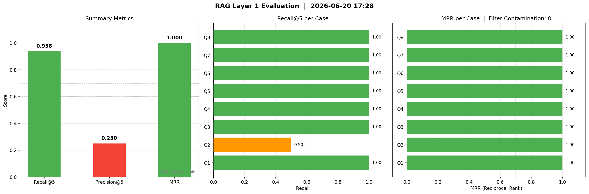
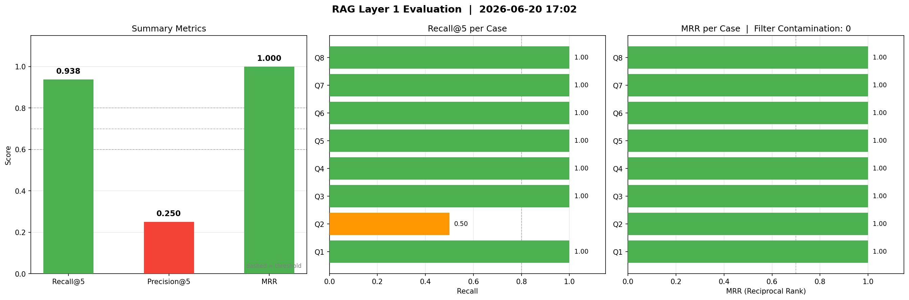
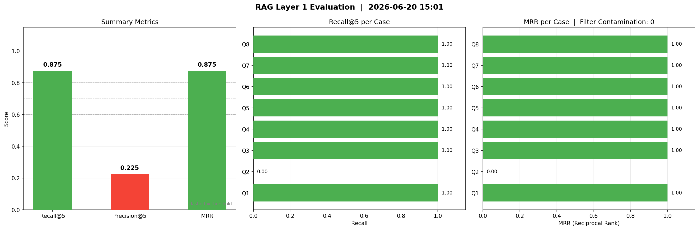

# RAG 레이어 1 평가 로그

> `scripts/eval_retrieval.py` 실행 시 자동으로 맨 위에 추가됨  
> 차트 읽는 법은 맨 아래 [차트 보는 법](#차트-보는-법) 참고

---

## 평가 — 2026-06-20 17:28



| 지표 | 결과 | 목표 | 판정 |
|---|---|---|---|
| Recall@5 | **0.938** | ≥ 0.80 | ✅ |
| Precision@5 | 0.250 | ≥ 0.60 | ❌ |
| MRR | **1.000** | ≥ 0.70 | ✅ |
| 필터 오염 | 0/8 | 0% | ✅ |

**주의 케이스**
  - 🟠 격조사 오류가 많은 만 4세 아동 평가 — Recall 0.50, MRR 1.00

---

## 2차 평가 — 2026-06-20 17:02

**변경 사항**: `doc_korean_morphosyntax` 내용 보강 (10청크 → 13청크) 후 재인제스트



| 지표 | 결과 | 목표 | 판정 |
|---|---|---|---|
| Recall@5 | **0.938** | ≥ 0.80 | ✅ |
| Precision@5 | 0.250 | ≥ 0.60 | ❌ |
| MRR | **1.000** | ≥ 0.70 | ✅ |
| 필터 오염 | 0/8 | 0% | ✅ |

**이 차트에서 볼 것**

왼쪽 요약 차트: Recall과 MRR이 초록색으로 올라왔고, MRR이 1.000으로 만점이 됐다. Precision@5는 여전히 빨간색.

가운데 Recall 차트: 1차에서 빨갛게 비어있던 Q2("격조사" 케이스)가 주황색 0.50으로 바뀌었다. 기대 문서 2개 중 1개(`doc_korean_morphosyntax`)는 찾게 됐고, 나머지 1개(`doc_language_sample_metrics`)는 아직 못 찾는다는 뜻.

오른쪽 MRR 차트: Q2가 초록색 1.00이 됐다. `doc_korean_morphosyntax`가 검색 1위로 올라왔다는 뜻. Recall은 0.50이어도 MRR이 1.00인 이유는, 정답 문서 중 하나가 정확히 1등에 있기 때문.

**1차 대비 변화**

| 케이스 | 1차 Recall | 2차 Recall | 1차 MRR | 2차 MRR |
|---|---|---|---|---|
| Q2 (격조사) | 0.00 ❌ | 0.50 🟠 | 0.00 | 1.00 ✅ |
| 나머지 7개 | 1.00 | 1.00 | 1.00 | 1.00 |

---

## 1차 평가 — 2026-06-20 15:01

**변경 사항**: IVFFlat 인덱스 삭제 후 sequential scan 전환 (최초 정상 측정)



| 지표 | 결과 | 목표 | 판정 |
|---|---|---|---|
| Recall@5 | 0.875 | ≥ 0.80 | ✅ |
| Precision@5 | 0.225 | ≥ 0.60 | ❌ |
| MRR | 0.875 | ≥ 0.70 | ✅ |
| 필터 오염 | 0/8 | 0% | ✅ |

**이 차트에서 볼 것**

왼쪽 요약 차트: Recall과 MRR은 목표치(점선) 위에 있어서 초록색. Precision@5만 목표(0.60)에 크게 못 미쳐 빨간색.

가운데 Recall 차트: Q2("격조사 오류가 많은 만 4세 아동 평가")만 0.00으로 빨간색. 관련 문서가 DB에 있는데도 검색이 안 됐다. 나머지 7개는 전부 1.00 초록색.

오른쪽 MRR 차트: 마찬가지로 Q2만 0.00. 나머지는 전부 정답이 검색 1등으로 나왔다는 뜻(1.00).

**Precision@5가 낮은 이유**: 상위 5개 결과 중 기대 문서가 1~2개뿐이고 나머지는 `doc_language_sample_analysis`가 반복 등장. 문서 수가 적어 한 문서가 검색을 과점하는 현상. 문서가 더 추가되면 자연히 개선 예상.

---

## 차트 보는 법

### 차트 구성

eval을 실행하면 3개 패널로 이루어진 PNG 하나가 생성된다.

```
[왼쪽]           [가운데]              [오른쪽]
Summary Metrics  Recall@5 per Case    MRR per Case
요약 3개 지표    케이스별 재현율       케이스별 순위 점수
```

---

### 왼쪽: Summary Metrics (요약 지표)

3개 막대 — Recall@5, Precision@5, MRR.

- **초록색** = 목표치(점선) 이상 → 합격
- **빨간색** = 목표치 미달 → 개선 필요
- **점선** = 목표 임계값 (Recall 0.80 / Precision 0.60 / MRR 0.70)

숫자가 점선보다 높으면 좋은 것. 낮으면 뭔가 문제가 있다는 신호.

---

### 가운데: Recall@5 per Case (케이스별 재현율)

Q1~Q8은 각각 평가에 사용한 질문이다.

| 색상 | 의미 |
|---|---|
| 초록 (1.00) | 기대 문서를 전부 찾음 |
| 주황 (0.01~0.99) | 기대 문서를 일부만 찾음 |
| 빨강 (0.00) | 기대 문서를 하나도 못 찾음 |

**빨간 막대 = 그 질문에 대해 RAG가 관련 문서를 전혀 못 찾고 있다는 뜻.**  
Claude가 이 질문을 받으면 근거 없이 답하거나 엉뚱한 문서를 참고하게 된다.

Q 번호와 실제 질문 매핑:

| Q | 질문 |
|---|---|
| Q1 | MLU 계산할 때 반복 발화는 어떻게 처리해야 하나요? |
| Q2 | 격조사 오류가 많은 만 4세 아동 평가 |
| Q3 | 성인 실어증 CIU 분석 결과 해석 |
| Q4 | 리포트에 장애가 있다고 써도 되나요? |
| Q5 | 말더듬 아동 중재 방법 |
| Q6 | 초등학교 3학년 이야기 구성 어려움 |
| Q7 | PRES 수용언어 점수가 표현언어 점수보다 낮아요 |
| Q8 | 단기 목표를 어떻게 작성해야 하나요? |

---

### 오른쪽: MRR per Case (케이스별 순위 점수)

Recall은 "찾았냐 못 찾았냐"인데, MRR은 **"몇 번째에 찾았냐"**까지 본다.

| 값 | 의미 |
|---|---|
| 1.00 | 정답 문서가 검색 1위로 나왔다 |
| 0.50 | 정답 문서가 검색 2위로 나왔다 |
| 0.33 | 정답 문서가 검색 3위로 나왔다 |
| 0.00 | 상위 5개 안에 정답이 없다 |

MRR이 높을수록 Claude 프롬프트의 앞부분에 관련 문서가 배치된다.  
LLM은 컨텍스트 앞쪽 내용을 더 잘 반영하므로 MRR이 높을수록 생성 품질이 좋아진다.

제목에 **Filter Contamination: 0** 이라고 표시된다. 숫자가 0이면 정상.  
이 숫자가 올라가면 age_group 필터가 오작동하고 있다는 신호다  
(예: 아동 질문에 성인 문서가 섞여서 나오는 경우).

---

### 요약: 이 차트에서 가장 먼저 봐야 할 것

1. 왼쪽에 **빨간 막대**가 있는가 → 있으면 어떤 지표가 목표 미달인지 확인
2. 가운데에 **빨간/주황 막대**가 있는가 → 있으면 몇 번 케이스인지 확인, Q 매핑표에서 어떤 질문인지 파악
3. 오른쪽 제목의 **Filter Contamination 숫자**가 0인가